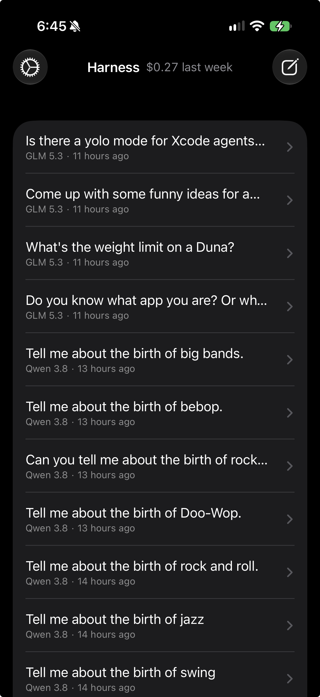

# Harness

A personal, privacy-first AI chat agent for iPhone. Harness talks to open-weight models through
[OpenRouter](https://openrouter.ai), routes every request only to **zero-data-retention** endpoints,
and can call tools on your phone, such as your calendar and the web.

Native SwiftUI + SwiftData. No third-party packages.

<p align="center">
  
</p>

## Features

- **Agent loop with tools.** The model can call tools. Harness runs them, sends the results back,
  and repeats until the model answers (at most 10 iterations). Each tool call shows inline as a
  row that you can expand to see its arguments and result.
- **Pick a model for each chat.** The New Chat menu offers Qwen 3.8, GLM 5.3, Kimi K3, and DeepSeek V4.1 Flash,
  plus any OpenRouter model slug that you set in Settings. You can change the model and the reasoning
  effort (Default / Low / Medium / High) during a chat.
- **Zero data retention.** Every request sends `"provider": {"zdr": true}`, so OpenRouter routes it only to
  providers that do not keep your data.
- **Cost tracking.** Each chat shows its cost (`Kimi K3 · Medium · $1.12`), and the home screen shows
  your spending over the last 7 days. The cost comes from the usage data that OpenRouter reports.
- **Smooth streaming.** A pacer reveals text at a steady rhythm. A paragraph or list item that has
  fully arrived fades in as one block. Slower streams appear word by word, and only whole words show,
  so a line never re-wraps mid-word. Your message pins to the top of the screen, and the reply grows
  down into the empty space below it, without moving the view.
- **Dictation, like Wispr Flow.** Tap the mic, speak, and tap ✓. The audio goes (with ZDR) to an audio model,
  which transcribes it and cleans it up: filler words are removed, and spoken corrections are applied
  ("Tuesday, no wait, Wednesday" becomes "Wednesday"). Then the message is sent. Silent recordings
  are detected on the device and are never uploaded.
- **Telemetry.** The debug sheet (🐞) shows, for each turn: latency (time to first byte, time to first token,
  total), token usage including reasoning tokens, cost, the serving provider, and tool-call
  argument parse failures.
- **Conversation management.** A spinner shows on each chat that is still answering. Swipe left on a chat to delete it.
  If its turn is still running, the delete also cancels the network request and any tool in progress.

## Tools

| Tool | What it does |
|---|---|
| `web_fetch` | Sends an HTTP GET to a URL, removes the HTML, and returns up to 20,000 characters of readable text. |
| `calendar_events` | Reads your events in a date range with EventKit. Read-only. Asks for calendar access on first use. |

To add a tool, create a type that conforms to `Tool`
([`Tools/Tool.swift`](Harness/Tools/Tool.swift)), then add it to `ToolRegistry.all`:

```swift
protocol Tool {
    var name: String { get }
    var description: String { get }
    var parameters: JSONValue { get }   // JSON Schema for the arguments
    func run(argumentsJSON: String) async throws -> String
}
```

## Getting started

**Requirements:** Xcode 27 or later (iOS 27 SDK). The app runs on iOS 26.6 or later.

1. Open `Harness.xcodeproj` and run the **Harness** scheme on a device or simulator.
2. Tap the gear icon and paste your OpenRouter API key. The key is stored in the Keychain only.
   It is never written to disk in any other place, and it is never logged.
3. Tap the compose icon, pick a model, and ask something like *"What's on my calendar tomorrow?"*

**Settings:**
- **Custom Model ID:** any OpenRouter model slug that supports tool calling. If it is not a preset, it
  appears as an extra option in the New Chat menu.
- **Dictation Model:** the audio model for dictation (default `google/gemini-3.8-flash`, the best
  ZDR audio model in testing).

## Project layout

```
Harness/
├── Agent/
│   ├── ChatSession.swift      # agent loop, tool execution, cancellation, SessionStore
│   ├── StreamPacer.swift      # block/word reveal pacing on a CADisplayLink
│   └── Dictation.swift        # recording, on-device speech check, transcription + cleanup
├── Networking/
│   ├── OpenRouterClient.swift # SSE streaming over URLSession.bytes(for:)
│   ├── OpenRouterTypes.swift  # request / response wire types
│   └── JSONValue.swift        # type-safe JSON for tool schemas
├── Models/                    # SwiftData: Conversation, Message, TurnRecord; ModelCatalog
├── Tools/                     # Tool protocol, registry, web_fetch, calendar_events
├── Support/KeychainStore.swift
└── Views/                     # chat, markdown, tool rows, settings, telemetry
Tools/DrawAppIcon.swift        # generates the Vitruvian Man app icon
```

**How a turn works:**
1. `ChatSession` sends the history plus the tool schemas to OpenRouter and streams the reply.
2. Tool-call argument fragments arrive in pieces. The client joins them by index.
3. When the reply contains tool calls, Harness runs each tool. It appends each result with the
   matching `tool_call_id`, then calls the model again.
4. The loop ends when a reply has no tool calls, or after 10 iterations. Messages, tool calls, results,
   and per-turn telemetry are all saved with SwiftData.

## App icon

The icon is a Vitruvian Man drawn in CoreGraphics from Leonardo's proportions. There are light, dark, and
tinted variants. To regenerate the icon, run:

```sh
swift Tools/DrawAppIcon.swift Harness/Assets.xcassets/AppIcon.appiconset
```

## Notes

- **Reasoning effort:** OpenRouter and its providers handle the effort setting very differently.
  On some models, choosing any explicit effort reduces reasoning, compared with Default. The debug
  sheet records the serving provider and the reasoning tokens for each request, so you can check what
  you get.
- **Streams are paced:** text appears a little after it arrives, at most about 0.35 s for word reveal.
  When a stream ends, the rest of the text appears within about 0.5 s.
